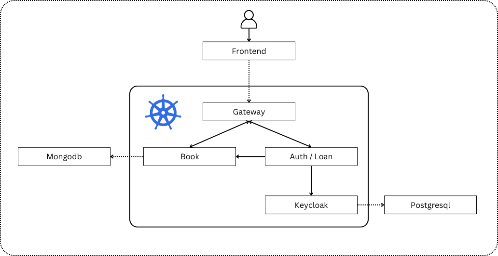

# kubernetes-play-ground
**Work in progress**
Learning kubernetes by building a library management plateform

The goal of the project is to learn how to build and deploy several web services with kubernetes, therefore the quality of the sprinboot code and that of the frontend is not of concern. I might improve it later, but the goal now is to get something up and running.

## Architecture

+ **Auth / Loan :** Manages user registration and requesting oauth tokens (From keycloak) and borrowing and returning books.
+ **Book :** Manages adding, updating and querying book info.
+ **Keycloak :** Single sign-on and identity and access management.
+ **Gateway :** Handles routing requests to their internal services.
+ **Frontend :** NextJs client.
+ **Mongodb / Postgresql :** Database / Data storage

